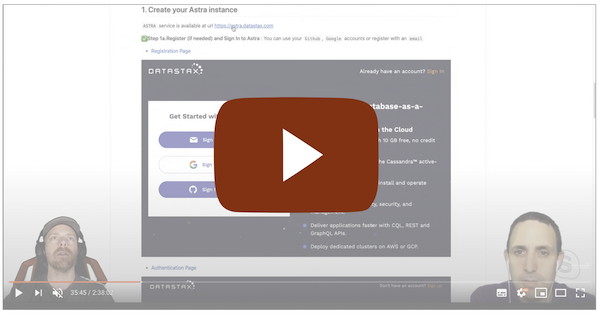
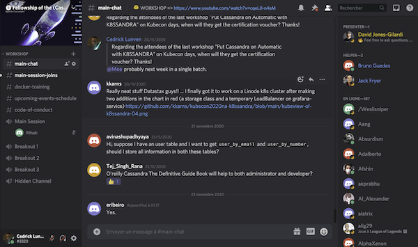

# 🚀 Deploy a JAMStack App + 🧑‍💻 Workshop

[](http://www.apache.org/licenses/LICENSE-2.0)
[](https://discord.com/widget?id=685554030159593522&theme=dark)
[](https://app.netlify.com/sites/battlestax-tutorial/deploys)

Welcome to **BattleStax**. In this workshop, we will give an overview of how to deploy a [JAMStack](https://jamstack.org/) game that uses [Netlify](https://www.netlify.com/jamstack/), [DataStax Astra](https://dtsx.io/workshop), and [GitHub](https://github.com/). 

## ℹ️ Housekeeping

It doesn't matter if you join our workshop live or you prefer to do at your own pace, we have you covered. In this repository, you'll find everything you need for this workshop.

### 🎥 Live and questions with Youtube**

The workshop is live Streamed on youtube, twitch and linkedin. After the session the recordings will be available on our [`DataStax Developers YouTube channel`](https://www.youtube.com/channel/UCAIQY251avaMv7bBv5PCo-A)

*Click The image to join the stream*

[](https://vimeo.com/datastax/review/478138764/8983f4fca5)

### 💬 Chat with Discord*

Join our discord room [*The Fellowship of the Rings*](https://discord.com/widget?id=685554030159593522&theme=dark) to chat with the team and meet our 6k+ community there.

[](https://discord.com/widget?id=685554030159593522&theme=dark)


# Let's get Started

## What is JAMStack?
Take a look at 📚 [What is the JAMStack](./README_JAM.md) to learn more in depth on how JAMStack functions, then come back here and we'll get started.

## Setup Repository

### GitHub
- Use this Template
  - include all branches
- GITPOD LINK
- git checkout full-game
- npm install

### Astra
- db name: battlestax_db
- keyspace: battlestax
- get environment vars

### Back to GitPod
- cp .env.example .env
- replace with env vars
- get auth token, and add
- Test. npm run test:functions

Awesome!
So what were these functions we just tested?
We talked about how JAMStack utilizes a CDN to host and distribute our app, in this case Netlify. These functions are the serverless functions that Netlify  uses to create api endpoints for the rest of our app. Let's set up Netlify and it will become more clear.


### Setup Netlify
- Go to https://www.netlify.com/ and create an account
- Create new site from git
- select repo
- click advanced deploy
- fill in environment vars
- Deploy site

While that is working, lets take a look at our code again.
We have a file here called netlify.toml
Here we provide netlify with some commands and a reference to where in our project we are storing our serverless functions
So in our functions folder we have all the endpoints our app needs. Let's take a look at one (insertGame.js)

### Serverless Functions

<details>
  <summary>helloWorld.js</summary>
  </br>
  ```javascript
  exports.handler = async (event, context) => {
    // let's return a JSON response that looks like: { hello: "world" }
    return {
      statusCode: 200,
      body: JSON.stringify({ hello: "world" }),
    };
  };
  ```
</details>

and a a real example:

```javascript
const { getGamesCollection } = require("./utils/astraClient");

exports.handler = async (event, context) => {
  let gameId;
  let gamePayload;
  try {
    gameId = event.path.split("insertGame/")[1];
    gamePayload = JSON.parse(event.body);
  } catch (e) {
    return {
      statusCode: 400,
      body: JSON.stringify({ message: "must provide a valid game ID" }),
    };
  }

  const gamesCollection = await getGamesCollection();

  try {
    const res = await gamesCollection.create(gameId, gamePayload);
    return {
      statusCode: 200,
      body: JSON.stringify(res),
    };
  } catch (e) {
    console.error(e);
    return {
      statusCode: 500,
      body: JSON.stringify(e),
    };
  }
};
```


Netlify only has master at this point, let's push the full-game branch
git push -f origin full-game:master
As you can see, Netlify already sees the new update and is building the new deploy


